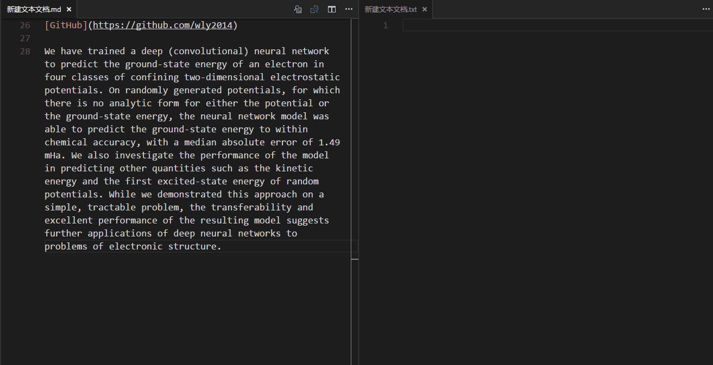

# TranslationToolbox README

翻译工具箱，使得文本翻译更加方便快捷，启用快捷键： `ctrl+alt+t or cmd+alt+t`

## Features

整合了百度，Google，Bing，以及有道翻译等翻译工具，使翻译结果更具有参考性。支持**选中即翻译**

## Quick Start

* 安装该扩展
* 使用快捷键 `ctrl+alt+t or cmd+alt+t` 启用TranslationToolbox扩展
* 选中想要翻译的文本，并将**鼠标移至其上**，即可显示翻译结果

## Release Notes

### 0.1.2

> 整合了**百度，Google，Bing，及有道**翻译的相关API
> 支持**选中即可翻译**

### 0.2.0

> 更新修复了有道翻译的相关API

### 0.3.0

> 更新修复了**百度翻译**的相关API

## Source

`软件出现翻译的API错误时，请通过Github提交issue通知我。`

[GitHub](https://github.com/wly2014/TranslationToolbox)

                
## License

[MIT](https://raw.githubusercontent.com/DonJayamanne/pythonVSCode/master/LICENSE)

-----------------------------------------------------------------------------------------------------------