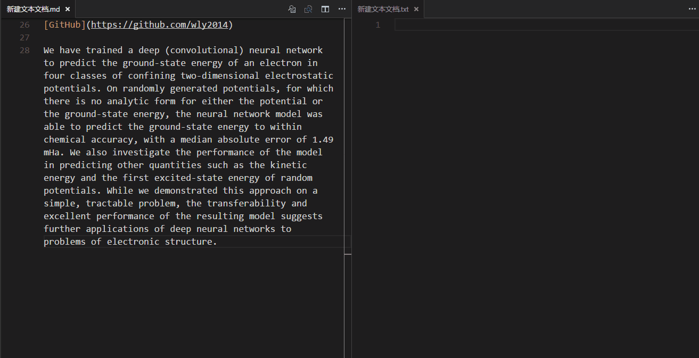
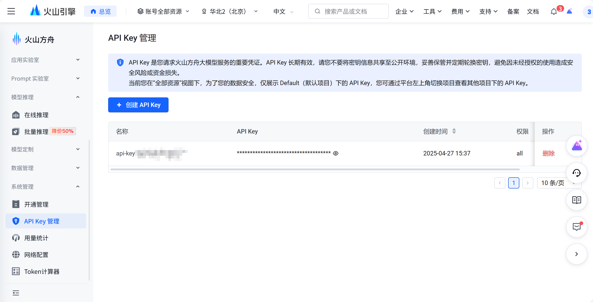
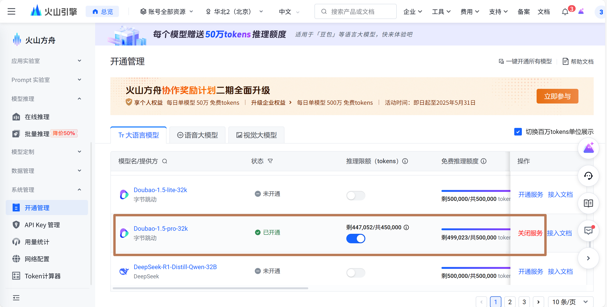
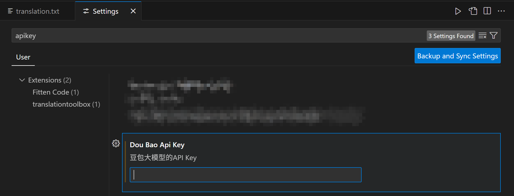

# TranslationToolbox README

翻译工具箱：窗口加载完成后扩展自动激活；快捷键 `ctrl+alt+t` / `cmd+alt+t` 仍可用于执行 **translate** 命令（可选）。

## Features

短词/短语使用**有道**建议接口，较长文本使用**豆包（火山方舟）**大模型翻译。支持**选中即翻译**（鼠标悬停查看结果）。

## Quick Start

* 安装该扩展（启动即激活，**无需**先按快捷键）
* 选中要翻译的文本，**鼠标悬停**即可查看结果（短词走有道；长句走豆包，需配置 API Key）
* 可选：快捷键 `ctrl+alt+t` / `cmd+alt+t` 执行 `translate` 命令

## Release Notes

### 0.1.2

> 整合了**百度，Google，Bing，及有道**翻译的相关API
> 支持**选中即可翻译**

### 0.2.0

> 更新修复了有道翻译的相关API

### 0.3.0

> 更新修复了**百度翻译**的相关API

### 0.4.1

> 更新修复了**有道翻译**的相关API

> TODO: 修复`百度翻译`

### 0.6.0

> **启动即激活**（`onStartupFinished`）；**长句翻译**须配置有效 `translationtoolbox.doubaoApiKey`（旧键 `DouBaoApiKey` 仍兼容）；**模型 ID** 与设置 `translationtoolbox.doubaoModel` 一致。

### 0.5.0

> 删除了有道翻译的部分API，增加了对**豆包大模型**翻译的支持。

启用豆包大模型需要注册个人账号以获取免费的大模型API，具体配置步骤如下：

1. 注册 [火山引擎](https://www.volcengine.com/) 账号，并完成验证

2. 在火山方舟中的 API Key 管理中申请并复制 API Key

3. 在火山方舟「开通管理」中激活模型 `Doubao-1.5-pro-32k`

4. 在 VS Code 设置中搜索 **`translationtoolbox.doubaoApiKey`**（或兼容旧项 **`DouBaoApiKey`**），填入 API Key。

## Source

`软件出现翻译的API错误时，请通过Github提交issue通知我。`

[GitHub](https://github.com/wly2014/TranslationToolbox)

                
## License

[MIT](https://raw.githubusercontent.com/DonJayamanne/pythonVSCode/master/LICENSE)

-----------------------------------------------------------------------------------------------------------